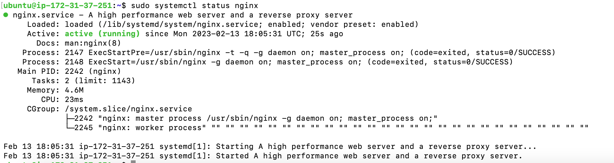
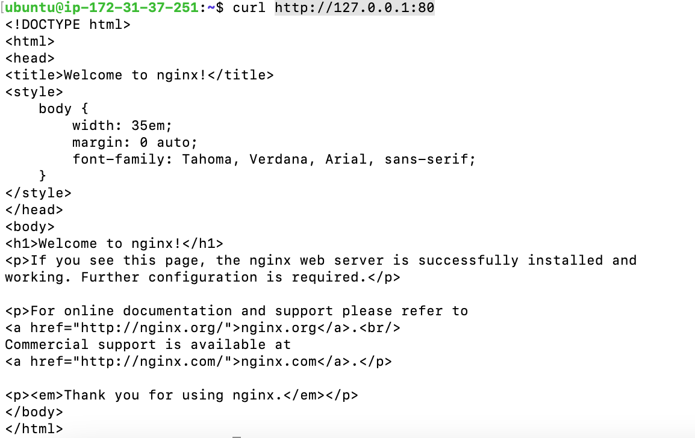
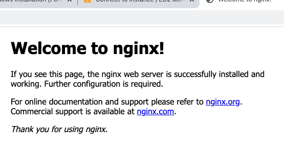

## Project 2 Documentation

Update repositories
`sudo apt update`

We use apt package manager to install this package
`sudo apt install nginx`
 
 Check nginx is properly installed

 `sudo systemctl status nginx`

 

To access nginx locally on ubuntu shell

`curl http://127.2.2.1:80`
and the page below is displayed:



 Retrieve Public IP address

 ```bash
 curl -s http://169.254.169.254/latest/meta-data/public-ipv4
 ```
 Paste in a web browser, if you see the following page, then nginx correctly installed and accessible through firewall.


### Installing mysql

Using 'apt' to acquire and install software

`sudo apt install mysql-server`

To log in, type:
`sudo mysql`

Defining root password as 'PassWord.1'

`ALTER USER 'root'@'localhost' IDENTIFIED WITH mysql_native_password BY 'PassWord.1';`

To exit MySQL shell, type: 
`exit`

Start the interactive script running:

`sudo mysql_secure_installation`

NB: This feature is optional, passwords not matching specified criteria will be rejected by MySQL with an error.

To enable, answer 'Y' for yes, or anything else to continue without enabling.

If yes, you'll be asked to select a level of password.

System will ask to confirm password for MySQL root user. When done, to test you can log on:
`sudo mysql -p`

### Installing PHP
To install 'php-fpm' which is php fastCGI process manager and php-mysql that allows php to communicate with mysql, type:
`sudo apt install php-fpm php-mysql`

Create root web directory for your_domain as follows:
`sudo mkdir /var/www/projectLEMP`

Assign ownership of the directory with the $USER environment variable, which will reference your current user:

`sudo chown -R $USER:$USER /var/www/projectLEMP`

Open a new configuration file in Nginx's sites-available directory

`sudo nano /etc/nginx/sites-available/projectLEMP`

Paste in the following bare-bones configuration:

```bash
#/etc/nginx/sites-available/projectLEMP

server {
    listen 80;
    server_name projectLEMP www.projectLEMP;
    root /var/www/projectLEMP;

    index index.html index.htm index.php;

    location / {
        try_files $uri $uri/ =404;
    }

    location ~ \.php$ {
        include snippets/fastcgi-php.conf;
        fastcgi_pass unix:/var/run/php/php8.1-fpm.sock;
     }

    location ~ /\.ht {
        deny all;
    }

}
```
To save and close file on nano, type 'CTRL+X' and then 'y' and 'ENTER'

Activate configuration

`sudo ln -s /etc/nginx/sites-available/projectLEMP  /etc/nginx/sites-enabled/`

To test configuration, type:` sudo nginx -t`

The following message shows config is fine:

```bash
nginx: the configuration file /etc/nginx/nginx.conf syntax is ok
nginx: configuration file /etc/nginx/nginx.conf test is successful
```
We need to disable default Nginx host that is configured to listen to port 80:

`sudo unlink /etc/nginx/sites-enabled/default`

To reload nginx

`sudo systemctl reload nginx`

Website is active but empty, to create an index.html file type:

`sudo echo 'Hello LEMP from hostname' $(curl -s http://169.254.169.254/latest/meta-data/public-hostname) 'with public IP' $(curl -s http://169.254.169.254/latest/meta-data/public-ipv4) > /var/www/projectLEMP/index.html`

To open on browser, type:

```bash
http://<Public-IP-Address>:80
```

You'll see text from 'echo' command

### Testing PHP with Nginx

To test Nginx can correctly handle .php, create a test file in document root named info.php:

`sudo nano /var/www/projectLEMP/info.php`

Type or paste:

```bash
<?php
phpinfo();
```
Access on web browser using the following link

```bash
http://`server_domain_or_IP`/info.php
```
The web page containing php version information will be displayed. To remove this file as it is sensitive, type

`sudo rm /var/www/projectLEMP/info.php`

### Create "To Do List" database
Connect to MySQL console

`sudo mysql -p`

Create a new database:
```bash
CREATE DATABASE `example_database`;
```
This creates a new user named 'example_user'. To define users password as 'password' type

`CREATE USER 'example_user'@'%' IDENTIFIED WITH mysql_native_password BY 'password';`

To give user permission over 'example_database' database, type:

`GRANT ALL ON example_database.* TO 'example_user'@'%';`

This will grant full privileges. You can exit by typing 'exit'

To test new user has proper permissions, log on again by typing

`mysql -u example_user -p`

To confirm which databases you have access to:

`SHOW DATABASES;`

You will see

```bash
Output
+--------------------+
| Database           |
+--------------------+
| example_database   |
| information_schema |
+--------------------+
2 rows in set (0.000 sec)
```
Run the following statement to create a test table named todo_list.

```bash
CREATE TABLE example_database.todo_list (
mysql>     item_id INT AUTO_INCREMENT,
mysql>     content VARCHAR(255),
mysql>     PRIMARY KEY(item_id)
mysql> );
```
To insert rows:

`mysql> INSERT INTO example_database.todo_list (content) VALUES ("My first important item");`

To confirm data was successfully saved:

`SELECT * FROM example_database.todo_list;`

To create a new PHP file in web root directory:

`nano /var/www/projectLEMP/todo_list.php`

Paste this content in the file todo_list.php:

```bash
<?php
$user = "example_user";
$password = "password";
$database = "example_database";
$table = "todo_list";

try {
  $db = new PDO("mysql:host=localhost;dbname=$database", $user, $password);
  echo "<h2>TODO</h2><ol>";
  foreach($db->query("SELECT content FROM $table") as $row) {
    echo "<li>" . $row['content'] . "</li>";
  }
  echo "</ol>";
} catch (PDOException $e) {
    print "Error!: " . $e->getMessage() . "<br/>";
    die();
}
```

Access on web browser public IP address for the website followed by /todo_list.php:

```bash
http://<Public_domain_or_IP>/todo_list.php
```
You'll see

